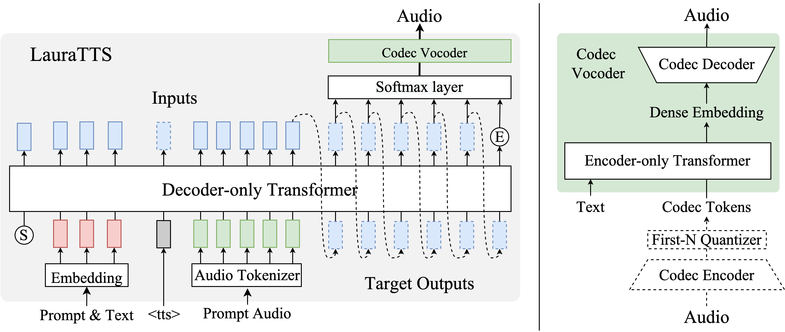

# Highlights
LauraTTS is a text-to-speech synthesizer based on the neural codec launage model. It supports:
- high quanlity speech synthesis
- zero-shot speaker adaption
- voice conversion capacity

# Introduce

<p align="center">

</p>

LauraTTS comprises two components：decoder-only auto-regressive Transformer LM  and Encoder-only None-autoregressive Transformer vocoder：
- Decoder-only Transformer can be treated as a conditional language model. The text prompt, text 和 audio prompt are treated as conditions, 
and the target codec tokens are modeled through the LM. Here, we use [FunCodec general model](https://www.modelscope.cn/models/damo/audio_codec-encodec-zh_en-general-16k-nq32ds640-pytorch/summary) 
to quantize the audio signals, and the first two-group codec tokens are used to represent the audio prompt and audio targets.
- Encoder-only Transformer treats the outputs of decoder-only Transformer as inputs, 
and the text is used as a condition to predict the dense encodings from [FunCodec general model](https://www.modelscope.cn/models/damo/audio_codec-encodec-zh_en-general-16k-nq32ds640-pytorch/summary).
After that, the dense encodings are transformed into raw waveforms with the decoder of FunCodec general model.

More details can be found：
- [FunCodec: A Fundamental, Reproducible and Integrable Open-source Toolkit for Neural Speech Codec](https://arxiv.org/abs/2309.07405)
- [LauraGPT: Listen, Attend, Understand, and Regenerate Audio with GPT](https://arxiv.org/abs/2310.04673)

# How to use

## Local inference
### Install FunCodec

- Install FunCodec

```sh
# Install Pytorch GPU (version >= 1.12.0):
conda install pytorch==1.12.0
# for other pytorch version, please refer https://pytorch.org/get-started/locally

# Download repo:
git clone https://github.com/alibaba-damo-academy/FunCodec.git

# Install FunCodec:
cd FunCodec
pip install --editable ./
```

### Use LauraTTS to synthesize speech
Take LibriTTS as an example, we introduce how to use LauraTTS to syntheize speech：
```sh
# entry workspace
cd egs/LibriTTS/text2speech_laura
model_name="audio_codec-encodec-en-libritts-16k-nq32ds640-pytorch"
# 1. free generation, the synthesized files are saved in results dir
bash demo.sh --stage 1 --model_name ${model_name} --output_dir results --text "nothing was to be done but to put about, and return in disappointment towards the north."

# 2. zero-shot generation given prompt text and audio, the synthesized files are saved in results dir
bash demo.sh --stage 2 --model_name ${model_name} --output_dir results --text "nothing was to be done but to put about, and return in disappointment towards the north." \
  --prompt_text "one of these is context" --prompt_audio "demo/8230_279154_000013_000003.wav"
```

### Use ModelScope to synthesize speech
```python
from modelscope.pipelines import pipeline
from modelscope.utils.constant import Tasks
my_pipeline = pipeline(
   task=Tasks.text_to_speech,
   model='damo/speech_synthesizer-laura-en-libritts-16k-codec_nq2-pytorch'
)
text='nothing was to be done but to put about, and return in disappointment towards the north.'
prompt_text='one of these is context'
prompt_speech='https://isv-data.oss-cn-hangzhou.aliyuncs.com/ics/MaaS/ASR/test_data/FunCodec/prompt.wav'
# free generation
print(my_pipeline(text))
# zero-shot generation give text and audio prompt
print(my_pipeline(text, prompt_text, prompt_speech))
```

### Train a model from scratch
To train a model from scratch, please refer `run.sh` for more details. 
In `run.sh`, we take the LibriTTS corpus as an example and provide the complete train and inference recipes.
You can adopt this script to train a model on your own data easily.

# Benchmark

## Training config
- Feature info: text, raw waveform input
- Train info: Adam, lr 1e-3, batch_bins 10240, 1 gpu(Tesla A100), acc_grad 1, 50 epoch, speech_max_length 30s
- Loss info: cross entropy, L1, L2
- Model info: Transformer, SEANet, Conv, LSTM
- Train config: config.yaml
- Model size: 84.19 M parameters

## Experimental results
- Test set: LibriTTS test-clean
- Metrics: WER and Ins, Del, Sub errors.
- Speaker similarity: Cosine similarity with Resemblyzer encoder

|       testset       |  WER  | Ins | Del | Sub  | Speaker Simi |
|:-------------------:|:-----:|:---:|:---:|:----:|:------------:|
| LibriTTS test-clean | 3.01  | 15  | 51  | 200  |    83.53     |
|       VALL-E        | 16.14 | 142 | 148 | 1137 |    68.17     |
|      LauraTTS       | 4.56  | 44  | 78  | 278  |    78.20     |

## Cites
```BibTeX
@misc{du2023funcodec,
      title={FunCodec: A Fundamental, Reproducible and Integrable Open-source Toolkit for Neural Speech Codec},
      author={Zhihao Du, Shiliang Zhang, Kai Hu, Siqi Zheng},
      year={2023},
      eprint={2309.07405},
      archivePrefix={arXiv},
      primaryClass={cs.Sound}
}
@misc{LauraGPT,
      title={LauraGPT: Listen, Attend, Understand, and Regenerate Audio with GPT},
      author={Jiaming Wang*, Zhihao Du*, Qian Chen, Yunfei Chu, Zhifu Gao, Zerui Li, Kai Hu, Xiaohuan Zhou, Jin Xu, Ziyang Ma, Wen Wang, Siqi Zheng, Chang Zhou, Zhijie Yan, Shiliang Zhang},
      year={2023},
      eprint={2310.04673},
      archivePrefix={arXiv},
      primaryClass={cs.AI}
}
```
